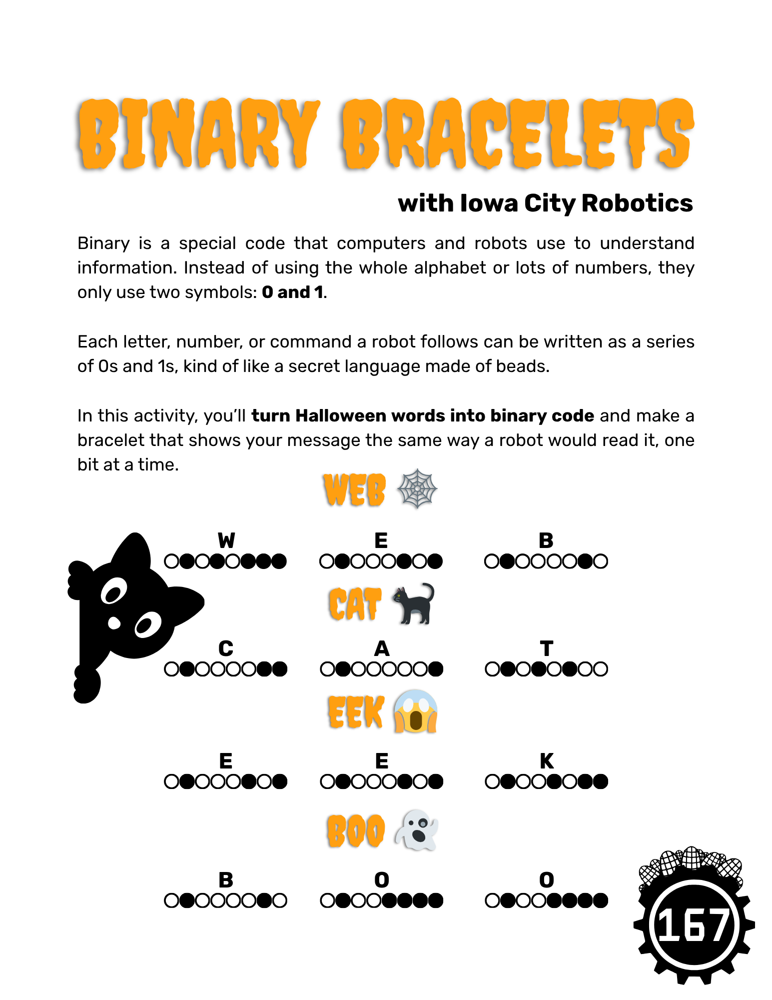

# Spooky Science

Try three fun Halloween-themed STEM experiments at home!

* **Binary Bracelets:** Learn how computers use code while making wearable patterns
* **Skeleton Hands:** Explore how tendons move our fingers with a simple paper model
* **Pumpkin Catapults:** Build and test mini launchers to learn about force and motion

<figure><figcaption></figcaption></figure> <figure><figcaption></figcaption></figure> <figure><figcaption></figcaption></figure>

