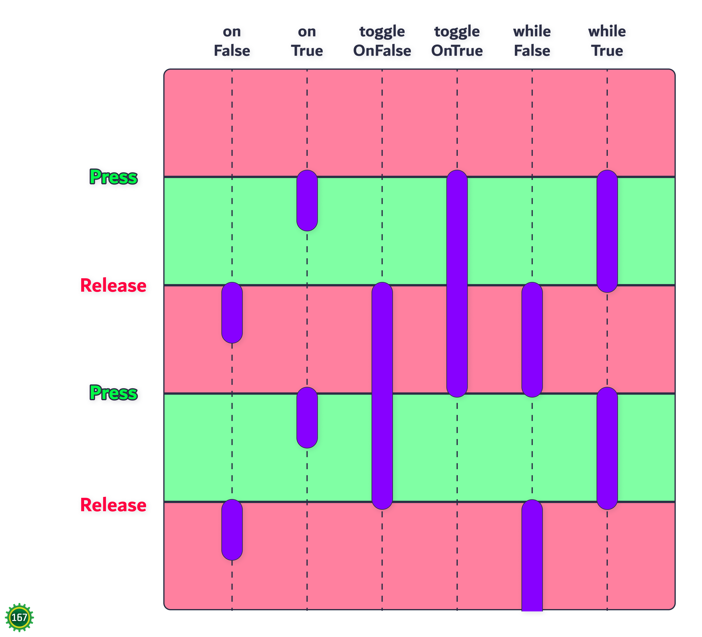

# Lesson 2.?: Binding Commands to Triggers

Accompanying code lesson: TODO

There are 6 methods that each schedule/cancel a command depending on how the state changes: `onFalse()`, `onTrue()`, `toggleOnFalse()`, `toggleOnTrue()`, `whileFalse()`, and `whileTrue()` . Each methods' behaviors are shown in the diagram below:

<figure><figcaption><p>How each binding method behave based on when the boolean state flips true or flips false. Based on a diagram by BoVLB.</p></figcaption></figure>

The syntax for binding a `Command` to a `Trigger` is as follows:

```java
trigger.whileTrue(subsystem.command())
```

For binding to a controller button, the syntax is as follows:

```java
controller.a().whileTrue(subsystem.command())
```

Code examples:

* Kernel Overflow (Team 167, Reefscape)
  * [Primary driver controls](https://github.com/icrobotics-team167/2025_Reefscape/blob/230afa18a2fbffd82682add448cd1f2adc900073/src/main/java/frc/cotc/Robot.java#L169-L182)
* Croppenheimer (Team 167, Crescendo)
  * [Secondary driver controls](https://github.com/icrobotics-team167/2024_Crescendo/blob/b1898be3392ba71757261eedc3181955ea389f3b/src/main/java/frc/robot/RobotContainer.java#L220-L231)
