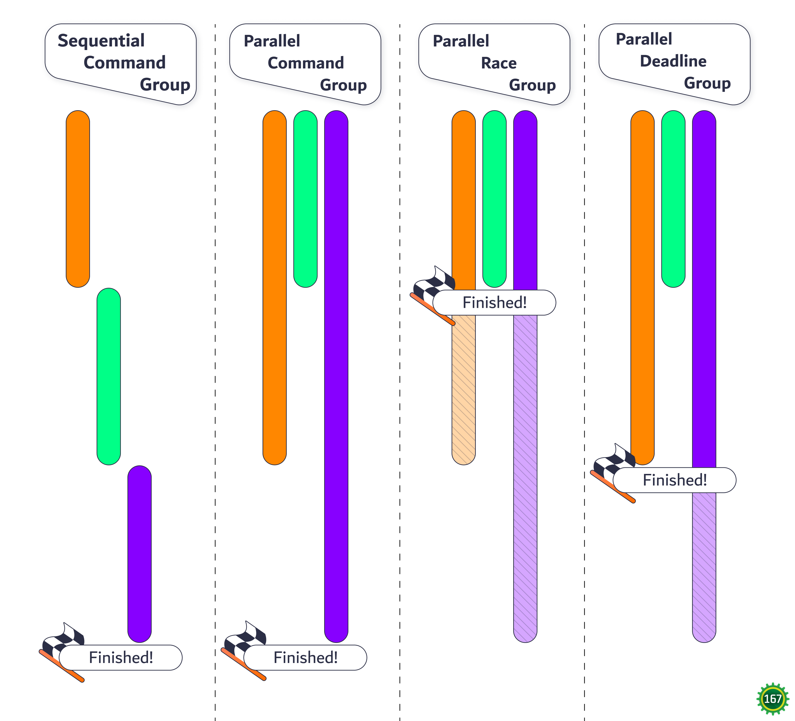

# Lesson 2.?: Command Groups

Accompanying code lesson: TODO

Commands can be grouped together in 4 ways: sequential, parallel, race, and deadline. This allows multiple commands to run together and act as one command, though each group type changes how the command group ends.

* Sequential
  * Starts the next command in the sequence when the previous command is done
  * Ends when the final command in the sequence is done
* Parallel
  * Runs all commands in the group at once
  * Ends when all the commands in the group are done
* Race
  * Runs all commands in the group at once
  * Ends when just one of the commands in the group is done
  * Cancels all other commands in the group when ending
* Deadline
  * The first command in the group is considered the "deadline"
  * Ends when the deadline command is done
  * Cancels any unfinished commands in the group when ending

<figure><figcaption><p>How each command group behaves.</p></figcaption></figure>

Command groups are not available from the `Subsystem` class, they are only available from the `Commands` static import.

Sequential group syntax example:

```java
sequence(
  command1(),
  command2(),
  // ...
  commandN())
```

Parallel group syntax example:

```java
parallel(
    command1(),
    command2(),
    // ...
    commandN())
```

Race group syntax example:

```java
race(
    command1(),
    command2(),
    // ...
    commandN())
```

Deadline group syntax example:

```java
deadline(
    deadlineCommand(),
    command1(),
    command2(),
    // ...
    commandN())
```
