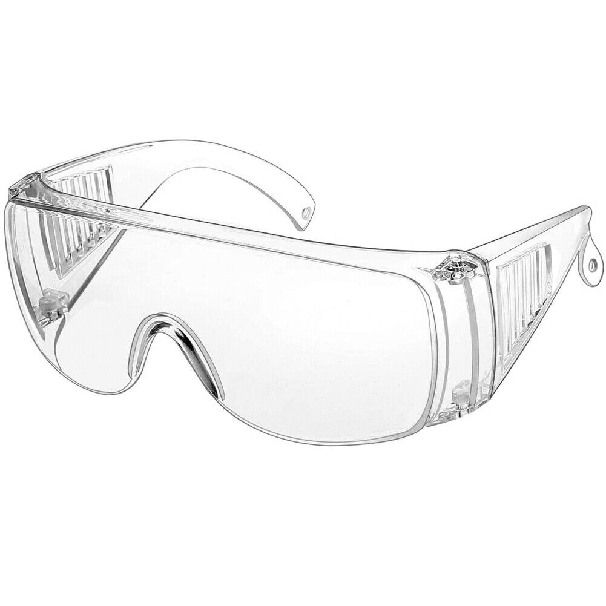
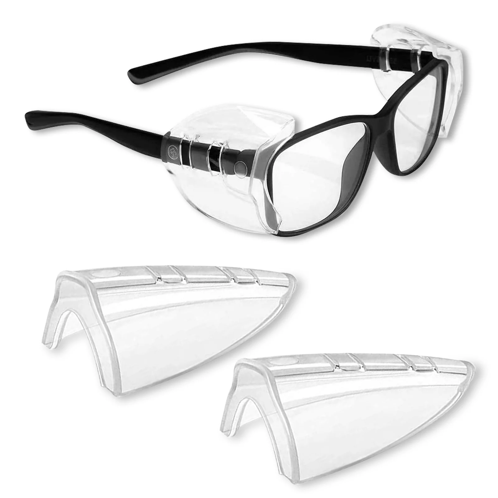

# Safety Glasses

There are several general rules of safety that apply to all contexts with FRC. However, one is the most prevailing: Wear Safety Glasses. All future chapters will assume this rule is to be kept in mind, but the first step for safety is always wear safety glasses

&#x20;At all times you should be wearing safety glasses, even though it might seem unnecessary, you will much rather wear safety glasses unnecessarily than lose an eye. Even if you wear glasses this is not enough, glasses don't offer enough protection to be able to protect your eyes from something coming in from the side. For those with glasses there are a couple options:

<figure><figcaption>
These allow you to wear your safety glasses over your regular glasses.
</figcaption></figure>

 

<figure><figcaption>
These are safety shields that can go onto the sides of your glasses to offer protection for your eyes.
</figcaption></figure>

